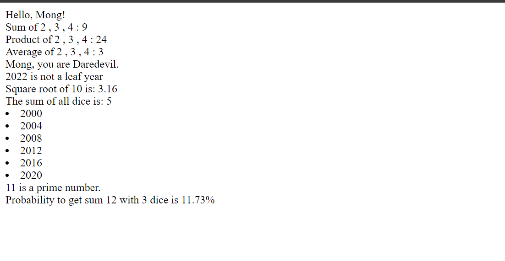

# JavaScript_Exercise1_Module1
## Module 1. Interactive programs + Conditional expressions and loops
1. Write a program that [logs to the console](https://github.com/ilkkamtk/JavaScript-english/blob/main/vuorovaikutteiset_ohjelmat.md#console-log) this text: `I'm printing to console!` (**1p**)
2. Write a program that [prompts](https://github.com/ilkkamtk/JavaScript-english/blob/main/vuorovaikutteiset_ohjelmat.md#feed-reading) for user's name and then greets the user. Print the result to [the HTML document](https://github.com/ilkkamtk/JavaScript-english/blob/main/vuorovaikutteiset_ohjelmat.md#printing-into-a-web-page): `Hello, Name!` (**2p**)
3. Write a program that prompts for three integers. The program prints the sum, product and average of the numbers to [the HTML document](https://github.com/ilkkamtk/JavaScript-english/blob/main/vuorovaikutteiset_ohjelmat.md#printing-into-a-web-page). (**3p**)
   * remember to [convert strings to numbers](https://github.com/ilkkamtk/JavaScript-english/blob/main/vuorovaikutteiset_ohjelmat.md#changing-the-type) when adding
4. In the Harry Potter children's books, the sorting hat assigns a new student at Hogwarts School of Witchcraft and Wizardry to one of the four classes, which are Daredevil, Slytherin, Hufflepuff, and Ravenclaw. Write an electronic sorting hat that asks for a student's name and draws a room for him. If you enter Anna as the name, for example, the program prints to the HTML document "Anna, you are Ravenclaw." (**3p**)
   * Use [math.random()](https://github.com/ilkkamtk/JavaScript-english/blob/main/valinta-toistorakenteet.md#dowhile) to draw a value (1, 2, 3 or 4)
   * Once the number is drawn, you need to use a multiple choice structure ([if, else if, ..., else or switch](https://github.com/ilkkamtk/JavaScript-english/blob/main/valinta-toistorakenteet.md#conditional-expressions)).
5. Write a program that asks the user to enter a year and notifies the user whether the input year is a leap year. A year is a leap year if it is divisible by four. However, years divisible by 100 are leap years only if they are also divisible by 400. Print the result on the HTML document. (**3p**)
6. Write a program that prints the text "Should I calculate the square root?" in a confirmation window. If the user selects OK, the program asks for the number and calculates and prints its square root to the HTML document. If the user selects Cancel, the program prints the text "The square root is not calculated." to the HTML document (**3p**)
   * The confirmation window can be displayed with the function [confirm()](https://github.com/ilkkamtk/JavaScript-english/blob/main/BOM-DOM-event.md#confirm). The function returns true if the user selects OK. If the user selects Cancel, the function returns false.
   * You cannot calculate the square root of a negative number. If the number entered by the user is negative, the program prints "The square root of a negative number is not defined" to the HTML document.
7. Write a program that asks the user for the number of dice rolls. The program throws all the dice once and prints the sum of the numbers. (**2p**)
8. Write a program that prompts the user for the start and end year. The program prints all leap years from the interval given by the user. Printing is done in an unordered list to the HTML document. (**3p**)
   * Example output HTML code:
   ```html
   <ul>
      <li>1992</li>
      <li>1996</li>
      <li>2000</li>
      <li>2004</li>
      <li>2008</li>
   </ul>
   ```
9. Write a program that asks the user for an integer and tells if the number is a prime number. (**2p**)
   * Prime numbers are numbers that are only divisible by 1 and itself.
   * For example, number 13 is a prime number as it can only be divided by 1 or 13 so that the result is an integer.
   * On the other hand, number 21 for example is not a prime number as it can be also be divided by numbers 3 and 7.
   * Print the result on the HTML document.
10. Make a program that asks the user for the number of dice and the sum of the eye numbers of interest to the user. The purpose of your program is now to find out with what probability the number of dice given by the user produces the sum of the number of eyes given by the user. For example, if the user enters 3 as the number of dice and 17 as the sum of the eyes, the program calculates the probability that the sum of the three dice's eye numbers is 17. (**5p**)
    * Solve the problem by simulating: Have the program roll a given number of dice in a for-loop (e.g. 10,000 times) and calculate what proportion of the repetitions produced the sum of eye numbers of interest to the user.
    * Print the result on the HTML document:
    ```text
    Probability to get sum 7 with 2 dice is 15.64%
    ```
    * you can limit the number of decimals with [toFixed()](https://developer.mozilla.org/en-US/docs/Web/JavaScript/Reference/Global_Objects/Number/toFixed)
    * test values:
       *  2 dice, sum 7, probability is about 15-17%
       *  3 dice, sum 15, probability is about 5%
       
       
```html
   <!DOCTYPE html>
<html lang="en" dir="ltr">

<head>
  <meta charset="utf-8">
  <title>JavaScript Exercise Module 1</title>

</head>

<body>
  <div id="module1-2">

  </div>
  <div id="module1-3a">

  </div>
  <div id="module1-3b">

  </div>
  <div id="module1-3c">

  </div>
  <div id="module1-4">

  </div>
  <div id="module1-5">

  </div>
  <div id="module1-6">

  </div>
  <div id="module1-7">

  </div>
  <div id="module1-8">

  </div>
  <div id="module1-9">

  </div>
  <div id="module1-10">

  </div>
  <script src="javaScriptModule1.js" charset="utf-8"></script>
</body>

</html>

```
```javascript

//1
console.log("I'm printing to console!");

//2
var name = prompt("What is your name? ");
document.querySelector('#module1-2').innerHTML = 'Hello, ' + name + '!';

//3
var num1 = parseInt(prompt("Input the 1st number: "));
var num2 = parseInt(prompt("Input the 2nd number: "));
var num3 = parseInt(prompt("Input the 3rd number: "));
var sum = num1 + num2 + num3;
var product = num1 * num2 * num3;
var average = (num1 + num2 + num3)/3;
document.querySelector('#module1-3a').innerHTML = "Sum of " + num1 +" , "+num2+" , "+num3+" : " + sum;
document.querySelector('#module1-3b').innerHTML = "Product of " + num1 +" , "+num2+" , "+num3+" : " + product;
document.querySelector('#module1-3c').innerHTML = "Average of " + num1 +" , "+num2+" , "+num3+" : " + average;

//4
var studentName = prompt("What is your name? ");
var drawNum = Math.floor(Math.random() * 4) + 1;
var room;
switch(drawNum){
  case 1:
    room = "Daredevil";
    break;
  case 2:
    room = "Slytherin";
    break;
  case 3:
    room = "Hufflepuff";
    break;
  case 4:
    room = "Ravenclaw";
    break;
}
document.querySelector('#module1-4').innerHTML = studentName + ', you are ' + room +'.';

//5
var year = parseInt(prompt("Input a year: "));
if (year % 4 === 0 && year % 100 !== 0 || year % 400 === 0){
  document.querySelector('#module1-5').innerHTML = year + " is a leaf year";
}
else {
  document.querySelector('#module1-5').innerHTML = year + " is not a leaf year";
}

//6
var response = confirm("Should I calculate the square root?");
if (response){
  var num = parseInt(prompt("Input a number to calculate sqrt: "));
  if (num < 0){
    document.querySelector('#module1-6').innerHTML = "The square root of a negative number is not defined";
  }
  else {
    document.querySelector('#module1-6').innerHTML = "Square root of " + num + " is: " + Math.sqrt(num).toFixed(2);
  }
}
else {
  document.querySelector('#module1-6').innerHTML = "The square root is not calculated.";
}

//7
var numDice = parseInt(prompt("How many dice? "));
var sumDice = 0;
for (let i = 1; i <= numDice; i++){
  sumDice += Math.floor(Math.random() * 6) + 1;
}
document.querySelector('#module1-7').innerHTML = "The sum of all dice is: " + sumDice;

//8
var startYear = parseInt(prompt("Enter start year: "));
var endYear = parseInt(prompt("Enter end year: "));

for (let i=startYear;i<=endYear;i++) {
  if (i % 4 === 0 && i % 100 !== 0 || i % 400 === 0) {
    document.querySelector('#module1-8').innerHTML += "<li>"+i+"</li>";
  }
}

//9
var prime = parseInt(prompt("Input a number: "));
var halfPrime = Math.floor(prime / 2);
var isPrime = true;
for (let i=2;i<=halfPrime;i++){
  if (prime%i === 0){
    isPrime = false;
    break;
  }
}
if (isPrime){
  document.querySelector('#module1-9').innerHTML = prime +" is a prime number."
}
else {
  document.querySelector('#module1-9').innerHTML = prime +" is not a prime number."
}

//10
var numDice = parseInt(prompt("Dice number: "));
var sum = parseInt(prompt("Sum of the eyes: "));
var count = 0;
for (let i = 1; i <= 10000; i++){
  var sumDice = 0;
  for (let i = 1; i <= numDice; i++){
    sumDice += Math.floor(Math.random() * 6) + 1;
  }
  if (sumDice === sum){
    count ++;
  }
}
var probability = (count / 100).toFixed(2);
document.querySelector('#module1-10').innerHTML = "Probability to get sum "+sum+" with "+numDice+" dice is "+probability +"%"
```

